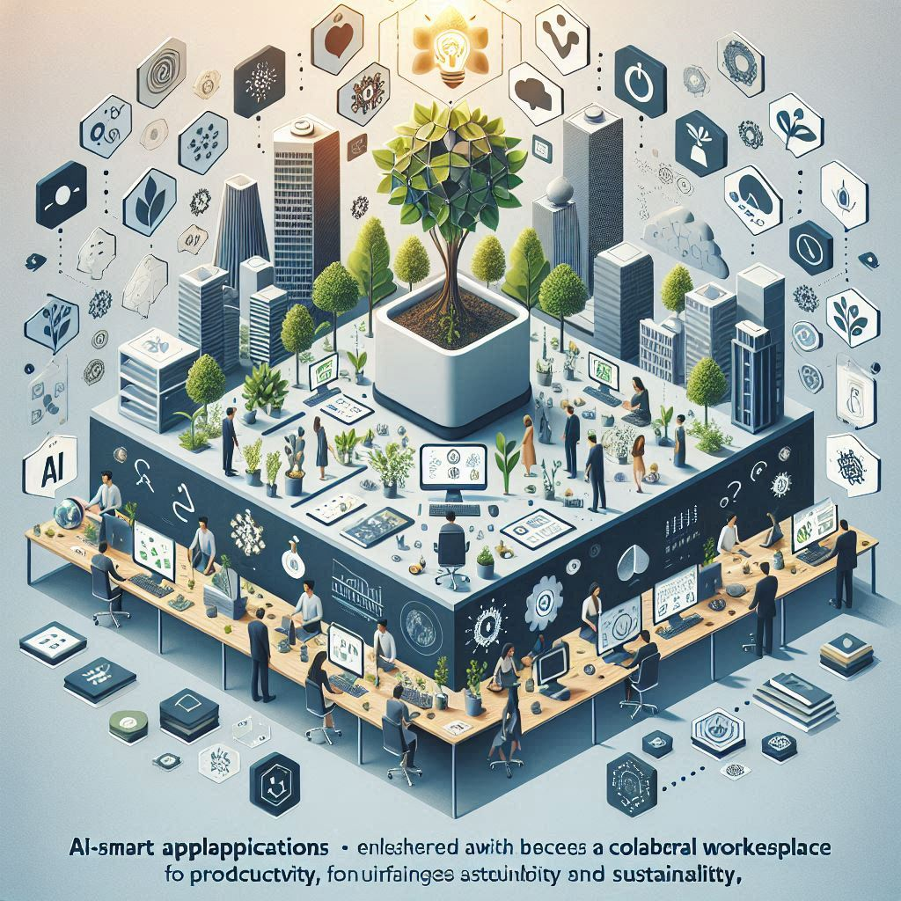

# Elevating Sustainability as an Atlassian Marketplace Partner

This collaboration is pivotal for both companies, combining [myHerb](https://myherb.co.il)’s commitment to eco-friendly practices with [Atlassian’s innovative software solutions](https://marketplace.atlassian.com/vendors/1225823/myherb).

<figure><figcaption></figcaption></figure>

### **A Synergy of Innovation and Sustainability**

[Atlassian](https://marketplace.atlassian.com/vendors/1225823/myherb), a global software development and collaboration tool leader, has always empowered teams to achieve their best. By partnering with [myHerb](https://myherb.co.il), [Atlassian](https://marketplace.atlassian.com/vendors/1225823/myherb) is taking a bold step towards incorporating sustainable practices into its ecosystem.&#x20;

> This partnership aligns seamlessly with [Atlassian](https://marketplace.atlassian.com/vendors/1225823/myherb)’s vision of fostering a more sustainable and environmentally conscious tech industry.

### [**myHerb**](https://myherb.co.il)**’s Contribution to the** [**Atlassian**](https://marketplace.atlassian.com/vendors/1225823/myherb) **Marketplace**

As an [Atlassian](https://marketplace.atlassian.com/vendors/1225823/myherb) Marketplace partner, [myHerb](https://myherb.co.il) brings a unique blend of sustainability and innovation. Here are some key contributions [myHerb](https://myherb.co.il) offers:

<figure><figcaption></figcaption></figure>

1. **Eco-Friendly Solutions**: [myHerb](https://myherb.co.il) provides a range of eco-friendly products and services that help reduce environmental impact. From sustainable farming solutions to biodegradable packaging, [myHerb](https://myherb.co.il) ensures that every product aligns with green practices.
2. **Educational Resources**: [myHerb](https://myherb.co.il) offers workshops and resources to help [Atlassian](https://marketplace.atlassian.com/vendors/1225823/myherb) users integrate sustainable practices into their daily operations. These resources empower teams to make informed decisions that benefit their projects and the environment.
3. **Customized Herb Blends**: Leveraging advanced algorithms, [myHerb ](https://myherb.co.il)creates personalized herb blends tailored to individual needs. This innovative approach promotes health and wellness and underscores the importance of sustainability in everyday life.
4. **Community Engagement**: [myHerb](https://myherb.co.il) fosters a vibrant community of sustainability advocates within the[ Atlassian](https://marketplace.atlassian.com/vendors/1225823/myherb) ecosystem. Through forums, events, and collaborative projects, [myHerb](https://myherb.co.il) encourages knowledge sharing and collective growth toward a greener future.

<figure><figcaption></figcaption></figure>

### **Empowering Teams with Sustainable Choices**

The partnership between [myHerb](https://myherb.co.il) and [Atlassian](https://marketplace.atlassian.com/vendors/1225823/myherb) empowers teams to make sustainable choices without compromising on productivity or innovation. By integrating [myHerb](https://myherb.co.il)’s eco-friendly solutions into their workflows, [Atlassian](https://marketplace.atlassian.com/vendors/1225823/myherb) users can contribute to a healthier planet while achieving their project goals.

### **A Commitment to a Greener Future**

This collaboration is more than just a business partnership; it’s a shared commitment to creating a sustainable future. [Atlassian](https://marketplace.atlassian.com/vendors/1225823/myherb) and [myHerb](https://myherb.co.il) are setting a new standard for sustainability in the tech industry, demonstrating that innovation and environmental responsibility can go hand in hand.

Join [myHerb ](https://myherb.co.il)and [Atlassian](https://marketplace.atlassian.com/vendors/1225823/myherb) on this exciting journey towards a greener, more sustainable world. We can significantly impact and cultivate a healthier planet for future generations.
