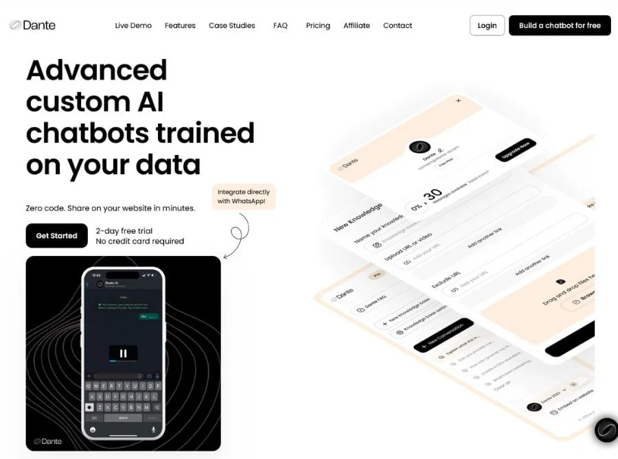

# Unleashing the Power of AI with myHerb’s Innovative Partners

#### **These collaborations not only enhance myHerb’s offerings but also drive a significant impact on sustainability and business efficiency. Let’s dive into the remarkable contributions of BigWord.ai,** [**Dante AI**](https://dante-ai.com/?via=myherb)**, CustomGPT, Murf AI, Kaspr.io, and docGPT.io, and discover how they are transforming the way businesses operate.**

### **BigWord.ai: Revolutionizing Communication**

BigWord.ai is at the forefront of AI-driven language solutions, offering real-time translation and transcription services that break down language barriers.&#x20;


[With a 95% accuracy rate in over 100 languages, BigWord.ai ensures seamless communication across global teams](https://www.dante-ai.com/)


[1](https://www.dante-ai.com/). This not only enhances collaboration but also reduces the need for travel, contributing to a lower carbon footprint.

<figure><figcaption></figcaption></figure>

### [**Dante AI**](https://dante-ai.com/?via=myherb)**: Crafting Hyper-Personalized Experiences**

[Dante AI](https://dante-ai.com/?via=myherb) specializes in creating hyper-personalized AI interactions that elevate customer engagement.&#x20;

[By leveraging advanced sentiment analysis and multilingual capabilities, Dante AI helps businesses increase client retention by up to 88%](https://techpp.com/2024/01/15/best-custom-gpt-in-chatgpt/)

<table data-view="cards"><thead><tr><th></th><th></th><th></th><th data-hidden data-card-target data-type="content-ref"></th><th data-hidden data-card-cover data-type="files"></th></tr></thead><tbody><tr><td></td><td></td><td></td><td><a href="../../about-us/vision-mission-and-focus-on-click-one-tree/">vision-mission-and-focus-on-click-one-tree</a></td><td><a href="../../.gitbook/assets/Dante AI.png">Dante AI.png</a></td></tr><tr><td></td><td></td><td></td><td></td><td><a href="../../.gitbook/assets/66819f29b9a94d61669de652_tab-img02.png">66819f29b9a94d61669de652_tab-img02.png</a></td></tr></tbody></table>

[2](https://techpp.com/2024/01/15/best-custom-gpt-in-chatgpt/). Their AI solutions are designed to be eco-friendly, utilizing energy-efficient algorithms that align with myHerb’s commitment to sustainability.

### **CustomGPT: Tailored AI Solutions for Every Need**

CustomGPT offers bespoke AI solutions that cater to specific business needs. [From automating customer support to providing detailed data analysis, CustomGPT’s no-code platform allows businesses to create custom AI agents effortlessly](https://www.dante-ai.com/)[3](https://customgpt.ai/). This not only boosts productivity but also reduces operational costs, making it a sustainable choice for companies looking to optimize their resources.

### **Murf AI: Voice Technology Redefined**

Murf AI is revolutionizing the voice technology space with its AI-powered voice generation tools. Capable of producing lifelike voices in multiple languages, Murf AI’s technology is used in everything from e-learning to marketing campaigns.&#x20;


By automating voiceover production, Murf AI helps businesses save time and resources, contributing to a more sustainable workflow.


### **Kaspr.io: Streamlining Lead Generation**

Kaspr.io simplifies the lead generation process with its AI-driven tools that provide accurate contact information and insights. [This enables sales teams to focus on high-quality leads, improving conversion rates by 30%](https://www.dante-ai.com/)[4](https://myherb.co.il/partners). By reducing the time spent on manual data entry, Kaspr.io helps businesses operate more efficiently and sustainably.

### **docGPT.io: Enhancing Document Management**

docGPT.io offers advanced document management solutions that automate the creation, editing, and organization of documents.&#x20;

With features like AI-powered summarization and real-time collaboration, docGPT.io enhances productivity and reduces paper usage, supporting myHerb’s sustainability goals.

## The Impact of AI on Sustainability

These partnerships exemplify how AI can drive both business success and sustainability. By automating processes, reducing resource consumption, and enhancing efficiency, these AI solutions help businesses minimize their environmental impact.&#x20;

myHerb’s collaboration with these innovative companies underscores its commitment to a greener future, making it a leader in sustainable business practices.

### Join the Movement

By integrating these cutting-edge AI solutions, myHerb not only enhances its service offerings but also sets a benchmark for sustainability in the industry.&#x20;

Whether you’re a business looking to optimize operations or an individual passionate about sustainability, myHerb and its partners offer the tools and expertise to make a meaningful impact.

Embrace the future of AI with myHerb and its visionary partners. Together, we can create a more efficient, sustainable, and prosperous world.

[1](https://www.dante-ai.com/)[: BigWord.ai’s accuracy rate and language capabilities.](https://techpp.com/2024/01/15/best-custom-gpt-in-chatgpt/)

[2](https://techpp.com/2024/01/15/best-custom-gpt-in-chatgpt/)[: Dante AI’s client retention statistics. ](https://customgpt.ai/)

[3](https://customgpt.ai/)[: CustomGPT’s no-code platform benefits. ](https://myherb.co.il/partners)

[4](https://myherb.co.il/partners): Kaspr.io’s lead conversion improvement.

***

Feel free to reach out if you need more details or specific information about any of these companies!
