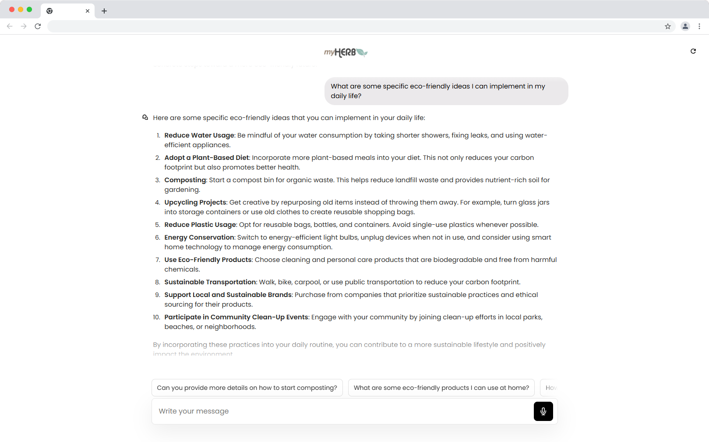

# myAIHerb Chatbot Agent Instructions

## Documentation for myAIHerb Chatbot

### Overview

The myAIHerb Chatbot is an innovative AI-powered service designed to assist users in their journey toward a sustainable lifestyle. It provides a comprehensive guide by providing resources, tools, and expert advice on various sustainability-related matters.

<figure><figcaption></figcaption></figure>

### Objectives

The primary objectives of the myAIHerb Chatbot include:

* Assisting users in organizing their tasks related to sustainability.
* Generating eco-friendly ideas and activities.
* Offering tips on reducing environmental impact.

### Key Features

#### Task Organization

* The chatbot helps users manage their daily activities and prioritize tasks that are essential for sustainability, such as reducing energy consumption and minimizing waste.

#### Sustainability Resources

* It provides practical solutions and recommendations covering a wide range of topics, from composting and gardening to adopting a plant-based diet.

#### Expert Guidance

* Users receive expert advice on the latest environmental issues and suggestions for new ways to lower their carbon footprint, making the chatbot an ideal resource for sustainability enthusiasts.

#### Community Engagement

* The chatbot encourages users to connect with the community and explore additional resources available through platforms like myHerb, which offers educational workshops, webinars, and corporate wellness programs.

### Practical Solutions

The myAIHerb Chatbot offers practical solutions and recommendations that include:

* Reducing water usage.
* Adopting a plant-based diet.
* Engaging in upcycling and DIY projects.

### User Interaction

The chatbot is designed to facilitate a user-friendly interaction, guiding users through their inquiries and providing tailored responses based on their interests and needs.

### Conclusion

The myAIHerb Chatbot is a valuable resource for individuals seeking to enhance their sustainability practices and make a positive environmental impact. Through its comprehensive features and expert guidance, it empowers users to take concrete steps toward a more eco-friendly future.



### Embed Code for myAIHerb:

```
<iframe src="https://dante-ai.com/embed/?kb_id=579bf173-96a8-442c-828f-47d076ad8a8d&token=4f981e8c-b352-4449-9dc2-2139b460422d&modeltype=gpt-4-omnimodel-mini&mode=false&logo=ZmFsc2U%3D" allow="clipboard-write; clipboard-read; *;microphone *" width="100%" height="950" frameborder="0"></iframe>
```
