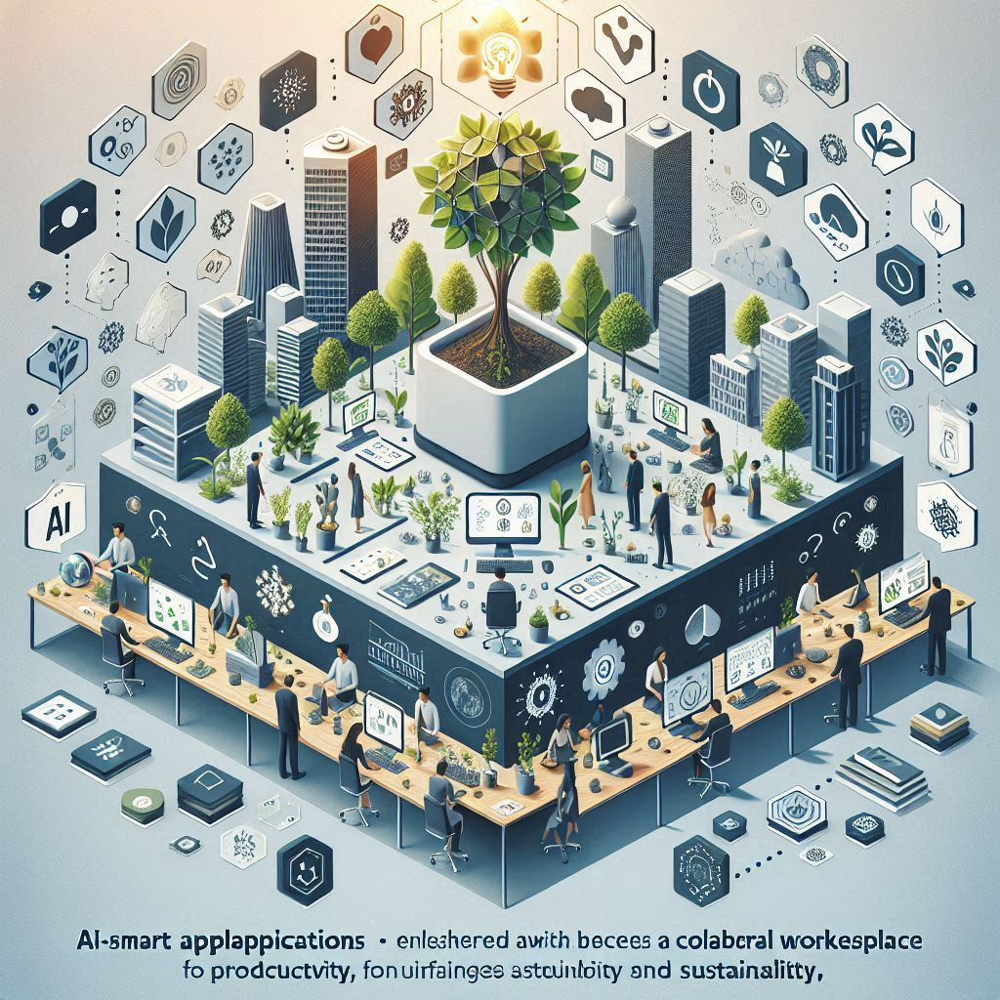

# myHerb Onboarding Guide

This guide reflects the visionary ethos and data-driven, sustainable practices championed by Aaron Levin and is meant to ensure every team member understands our situation, goals, and the unique approach to making an eco-friendly impact.

***

_Embracing Sustainability & Innovative Practices in Marketing and Development_

***

## 1. Welcome to the myHerb Family

**Introduction:**\
Welcome to myHerb—a platform built around the belief that positive change in our planet is possible when innovation meets sustainability. Our founder, Aaron Levin, has built a company where every decision is driven by data, transparency, and a passion for eco-friendly practices. You’re not just joining a company; you’re joining a movement dedicated to making our world a greener, more equitable place.

**Your Role in Our Vision:**\
Whether you’re a manager strategizing long-term goals, a volunteer supporting our daily initiatives, or a freelancer adding your creative and technical expertise, your contribution is key. At myHerb, every action—every campaign, every code update—is a building block toward a more sustainable future.

***

## 2. Understanding myHerb: Our Mission and Core Values

### **Our Mission:**

* To create and promote eco-friendly practices across products, services, and operations.
* To blend data-driven insights with authentic, sustainable actions.
* To build a transparent community that champions continuous improvement in environmental stewardship.

<figure><figcaption></figcaption></figure>

### **Core Values:**

* **Sustainability:** Every decision reflects a commitment to a greener planet.
* **Transparency:** Clear, measurable outcomes; open communication builds trust.
* **Collaboration:** Diverse ideas and roles come together to drive innovation.
* **Innovation:** Leveraging technology and creativity to solve modern sustainability challenges.

Aaron Levin’s leadership is built around these pillars, ensuring actions are not only visionary but also measurable and accountable.

***

## 3. Our Organizational Structure and Key Teams

To achieve our mission, myHerb consists of interconnected teams:

* **Management Team:**
  * Oversees strategy, operations, and ensures that every initiative aligns with our sustainability goals.
  * Sets clear, measurable targets and maintains accountability through data-driven reporting.
* **Marketing Team:**
  * Shapes the voice of myHerb by bringing our sustainability vision to life.
  * Handles digital campaigns, branding, content creation, public relations, and community engagement.
* **Development Team:**
  * Builds and optimizes the technical infrastructure needed to support our eco-conscious strategies.
  * Focuses on developing efficient digital solutions, analytical dashboards, and integrating systems that track our sustainability metrics.

Everyone’s role is interconnected. Marketing tells our story; Development builds the tools that make our story powerful, and Management steers the vision with a sustainability-first mindset.

<figure><figcaption></figcaption></figure>

***

## 4. Your Onboarding Journey: Step by Step

### **Phase 1: Pre-Onboarding**

* **Documentation & Introduction:**
  * Complete necessary HR documentation.
  * Receive an introductory email with essential readings, including our sustainability manifesto and recent impact reports.

### **Phase 2: Day 1 Orientation**

* **Company Overview Session:**
  * An interactive presentation on myHerb’s history, vision, and the journey toward our sustainable future.
  * A welcome message from leadership, with insights into Aaron Levin’s data-driven, eco-conscious approaches.
* **Culture & Values Workshop:**
  * Sessions that dive deep into our core values and practical examples of how these translate into every project and decision.

### **Phase 3: Team Integration**

* **Meet the Team:**
  * Detailed introductions to key team members and direct supervisors in both Marketing and Development.
  * Assignment of a mentor or buddy for hands-on support during these early stages.
* **Systems and Tools Setup:**
  * Access to internal communication channels (Slack, email groups, project management tools like Trello or Jira).
  * A guided walkthrough of our digital workspace and repositories (including our analytics dashboards).

### **Phase 4: Role-Specific Training and Projects Initiation**

* **For Marketing Team Members:**
  * **Orientation on Brand Messaging:**
    * Overview of our eco-friendly brand identity, tone, and storytelling that inspires our community.
  * **Training Modules:**
    * Workshops on content creation strategies, social media engagement, and using analytics tools to refine our campaigns.
  * **Initial Projects:**
    * Dive into real-time campaigns or content initiatives that showcase our sustainability efforts. You’ll receive actionable briefs aligned with our KPIs such as engagement, reach, and brand sentiment.
* **For Development Team Members:**
  * **Technical Onboarding:**
    * Detailed codebase walkthrough and an introduction to our analytics framework, emphasizing sustainability metrics.
  * **Tool Training:**
    * Sessions on our technological stacks, including version control, continuous integration systems, and energy-efficient coding practices.
  * **Initial Projects:**
    * Begin with tasks that might include optimizing existing systems for better eco-efficiency or building components for real-time data dashboards tracking our sustainability targets.

<figure><figcaption></figcaption></figure>

### **Phase 5: Ongoing Support & Feedback**

* **Regular Check-ins:**
  * Weekly team meetings for progress updates.
  * One-on-one mentorship sessions to address challenges and brainstorm improvements.
* **Feedback Loops:**
  * Opportunities to provide input on tools, processes, and the overall onboarding experience.
  * Participation in community forums to share and receive feedback on our journey toward sustainability.

***

## 5. Performance Metrics and Growth Opportunities

### **Key Performance Indicators (KPIs):**

* **Marketing:**
  * **Engagement & Reach:** Monitor audience interaction with sustainable content.
  * **Campaign Performance:** Evaluate conversion rates, traffic growth, and community growth.
  * **Storytelling Impact:** Assess how well our messages are resonating emotionally and spurring action.
* **Development:**
  * **Code Efficiency & Innovation:** Measurement of optimized code performance and system sustainability.
  * **System Uptime & Resource Optimization:** Metrics ensuring that our platforms are energy efficient.
  * **Feature Impact:** Quantitative tracking of new features that improve transparency and operational eco-efficiency.

### **Professional Growth:**

* **Training Workshops:**
  * Continuous learning sessions on advanced analytics, innovative marketing trends, and emerging sustainable technologies.
* **Mentorship Programs:**
  * Regular sessions with senior members to refine your specific skill set.
* **Collaborative Innovation:**
  * Opportunities to participate in cross-functional projects that drive real-world sustainability change.

***

## 6. Communication, Collaboration, and Best Practices

### **Collaboration Tools:**

* **Slack & Email:**
  * For day-to-day interactions and quick problem-solving.
* **Project Management Platforms (Trello/Jira):**
  * To track tasks, deadlines, and progress on projects.
* **Company Wiki:**
  * A central repository for resources, updated best practices, and sustainability insights.

### **Best Practices:**

* **Be Data-Driven:**
  * Always refer back to our analytics and performance metrics when shaping strategies.
* **Embody Transparency:**
  * Share your progress, challenges, and successes openly. We learn and grow together.
* **Champion Sustainability:**
  * Every project, whether it’s a marketing campaign or a software update, should reflect our commitment to eco-friendly practices.
* **Stay Inquisitive:**
  * Regularly participate in brainstorming sessions and contribute new ideas that can elevate our mission.

***

## 7. Additional Resources & Next Steps

#### **Essential Reading and Resources:**

* **Sustainability Manifesto & Impact Reports:**
  * Documents that share our historical performance, future goals, and the inspirational journey of myHerb.
* **Training Guides & Workshops:**
  * Detailed session guides on the tools, methodologies, and best practices specific to your role.
* **Feedback Channels:**
  * Methods to share your ideas for process improvements, ensuring your voice is heard as we grow.

<figure><figcaption></figcaption></figure>

### **Your Next Steps:**

* Review the provided materials before your first team meeting.
* Set up and familiarize yourself with all necessary tools (Slack, project management software, analytics dashboards).
* Schedule an introductory session with your mentor or team lead to discuss your first project.
* Reflect on how your unique skills can contribute to our sustainability mission and be prepared to share your vision.

***

## 8. Final Thoughts

At myHerb, every one of us plays an integral role in driving forward not just a business, but a visionary movement for sustainability and innovative growth. Your contributions—whether strategic, creative, or technical—will have a real impact on how we shape our environment and community. We believe that true innovation comes when every idea is nurtured and every voice is heard.

As you progress in your role, consider how you can further integrate your area of expertise (be it groundbreaking marketing strategies or cutting-edge technical solutions) into our broader mission of eco-conscious progress. Let’s set new standards for what sustainability looks like in practice.

***

### **Questions to Consider Moving Forward:**

* What new sustainable practices can we implement in our daily operations?
* How can marketing and development work even more seamlessly to enhance transparency and measurable impact?
* Are there untapped channels or technological innovations we can explore to further our mission?

Welcome aboard—your journey with myHerb is just beginning, and every step you take will help pave the way towards a more sustainable future.
